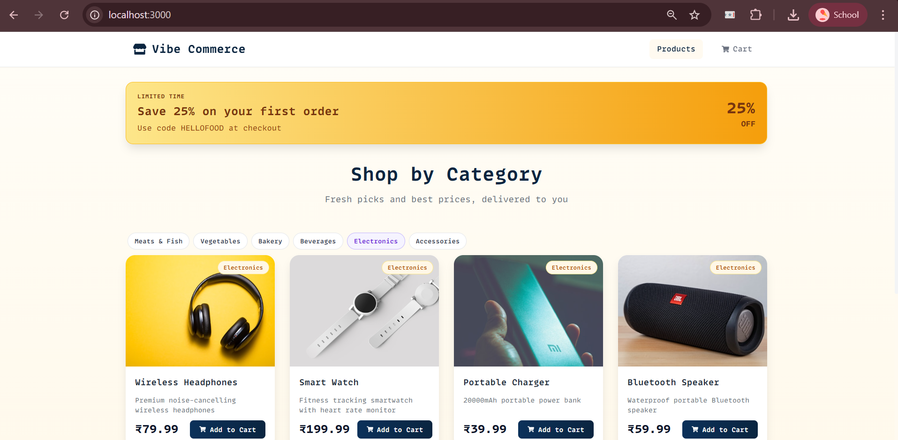
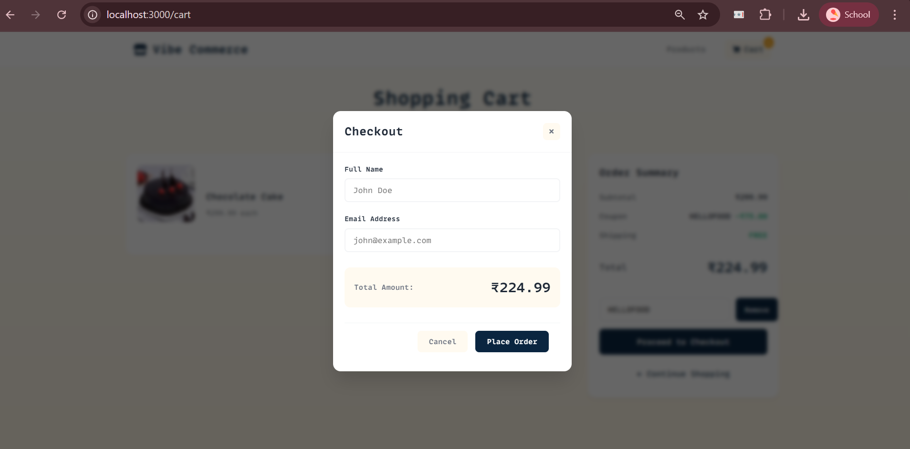
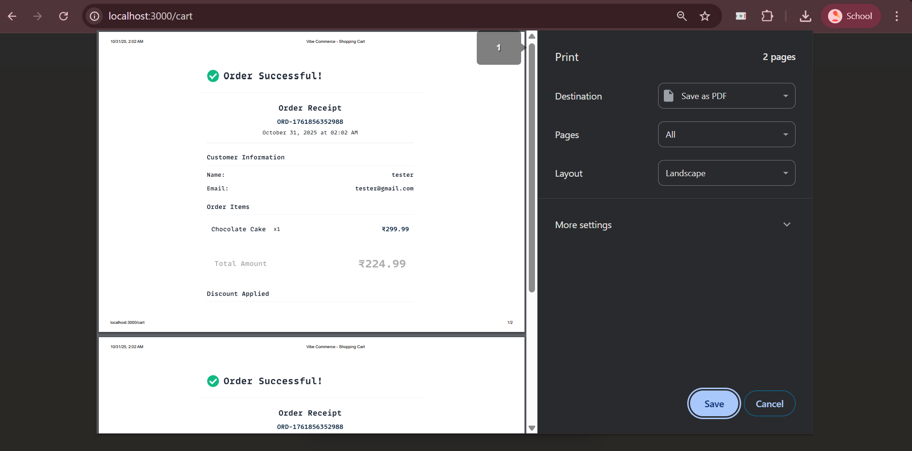
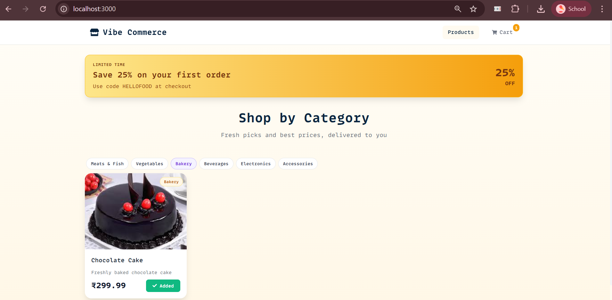
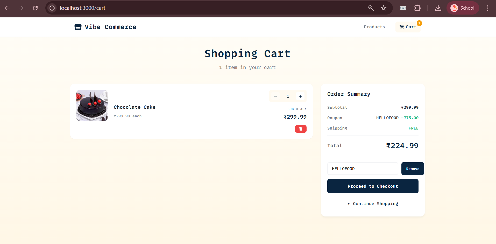
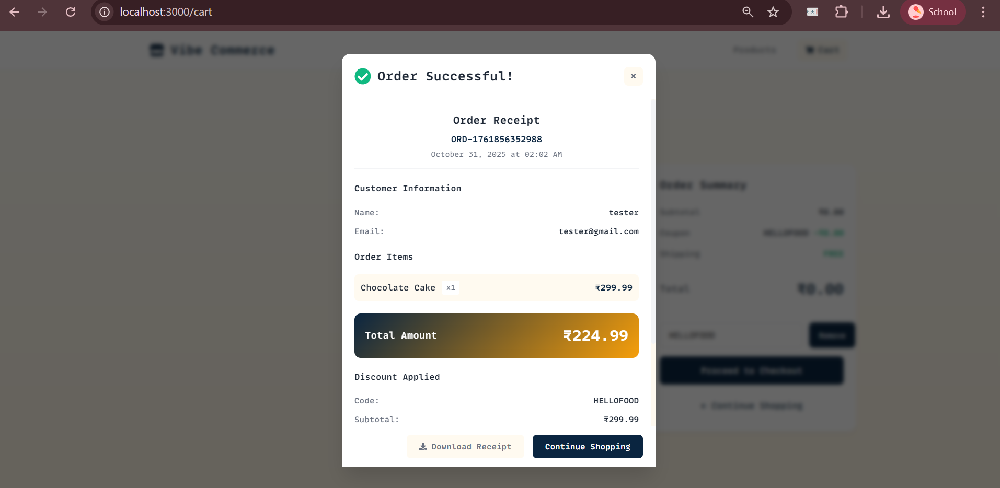
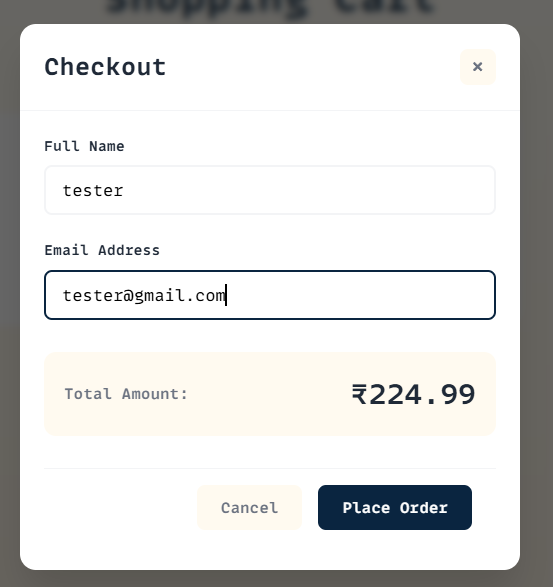
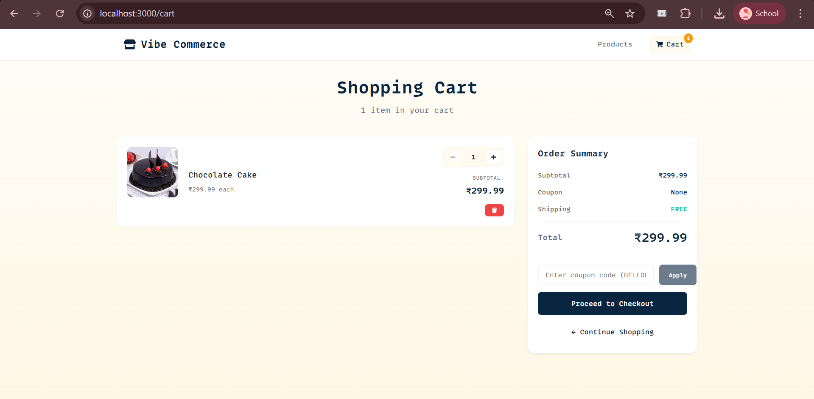

# Vibe Commerce - Full Stack E-Commerce Cart Application

A modern, fully-featured shopping cart application built with React, Node.js, Express, and SQLite. This project demonstrates a complete e-commerce checkout flow with a beautiful, responsive UI.


## Project Overview

Note: All amounts are shown and processed in Indian Rupees (INR, ₹).

Vibe Commerce is a full-stack shopping cart application that demonstrates real-world e-commerce functionality including:
- Product browsing with dynamic grid layout
- Shopping cart management (add, update, remove items)
- Real-time cart updates and persistence
- Checkout flow with customer information
- Order receipt generation
- Responsive design for all devices

## Features

### Core Features
- **Product Catalog**: Browse 10 mock products with images, descriptions, and prices
- **Shopping Cart**: Add, update quantities, and remove items
- **Real-time Updates**: Cart count badge updates instantly
- **Checkout Process**: Customer information form with validation
- **Order Receipt**: Beautiful receipt modal with order details
- **Database Persistence**: SQLite database for products, cart, and orders

### Technical Features
- **RESTful API**: Complete backend API with proper HTTP methods
- **Error Handling**: Comprehensive error handling on both frontend and backend
- **Form Validation**: Email and required field validation
- **Responsive Design**: Mobile-first design that works on all screen sizes
- **Modern UI/UX**: Beautiful gradient design with smooth animations
- **Loading States**: Proper loading indicators for async operations

## Tech Stack

### Frontend
- **React 18** - UI framework
- **React Router** - Client-side routing
- **Axios** - HTTP client
- **Vite** - Build tool and dev server
- **React Icons** - Icon library
- **CSS3** - Modern styling with CSS variables

### Backend
- **Node.js** - Runtime environment
- **Express** - Web framework
- **better-sqlite3** - SQLite database driver
- **CORS** - Cross-origin resource sharing
- **Body Parser** - Request body parsing

## Project Structure

```
assignment-Nexora/
├── backend/
│   ├── server.js              # Express server and API routes
│   ├── initDb.js              # Database initialization script
│   ├── package.json           # Backend dependencies
│   └── ecommerce.db          # SQLite database (generated)
│
├── frontend/
│   ├── src/
│   │   ├── components/        # React components
│   │   │   ├── Navbar.jsx
│   │   │   ├── ProductCard.jsx
│   │   │   ├── CartItem.jsx
│   │   │   ├── CheckoutModal.jsx
│   │   │   └── ReceiptModal.jsx
│   │   ├── pages/            # Page components
│   │   │   ├── Products.jsx
│   │   │   └── Cart.jsx
│   │   ├── services/         # API services
│   │   │   └── api.js
│   │   ├── App.jsx           # Main app component
│   │   └── main.jsx          # Entry point
│   ├── index.html            # HTML template
│   ├── vite.config.js        # Vite configuration
│   └── package.json          # Frontend dependencies
│
└── README.md                 # This file
```

## Getting Started

### Prerequisites
- Node.js (v16 or higher)
- npm or yarn
- Git

### Installation

1. **Clone the repository**
```bash
git clone https://github.com/yourusername/assignment-Nexora.git
cd assignment-Nexora
```

2. **Set up the Backend**
```bash
cd backend
npm install
npm run init-db
npm start
```

The backend server will start on `http://localhost:5000`

3. **Set up the Frontend** (in a new terminal)
```bash
cd frontend
npm install
npm run dev
```

The frontend will start on `http://localhost:3000`

4. **Open your browser**
Navigate to `http://localhost:3000` to view the application.

## API Documentation

All numeric amount fields in the API (e.g., price, subtotal, total) are INR values.

### Products

#### GET `/api/products`
Get all products

**Response:**
```json
{
  "success": true,
  "data": [
    {
      "id": 1,
      "name": "Wireless Headphones",
      "price": 79.99,
      "description": "Premium noise-cancelling wireless headphones",
      "image": "https://...",
      "category": "Electronics"
    }
  ],
  "count": 10
}
```

### Cart

#### GET `/api/cart`
Get cart items with total

**Response:**
```json
{
  "success": true,
  "data": {
    "items": [
      {
        "id": 1,
        "quantity": 2,
        "product_id": 1,
        "name": "Wireless Headphones",
        "price": 79.99,
        "image": "https://...",
        "subtotal": 159.98
      }
    ],
    "total": 159.98,
    "count": 1
  }
}
```

#### POST `/api/cart`
Add item to cart

**Request Body:**
```json
{
  "productId": 1,
  "quantity": 2
}
```

**Response:**
```json
{
  "success": true,
  "message": "Item added to cart",
  "data": {
    "id": 1,
    "quantity": 2
  }
}
```

#### PUT `/api/cart/:id`
Update cart item quantity

**Request Body:**
```json
{
  "quantity": 3
}
```

#### DELETE `/api/cart/:id`
Remove item from cart

**Response:**
```json
{
  "success": true,
  "message": "Item removed from cart"
}
```

### Checkout

#### POST `/api/checkout`
Process checkout

**Request Body:**
```json
{
  "customerName": "John Doe",
  "customerEmail": "john@example.com",
  "cartItems": [...]
}
```

**Response:**
```json
{
  "success": true,
  "message": "Order placed successfully",
  "data": {
    "orderId": 1,
    "customerName": "John Doe",
    "customerEmail": "john@example.com",
    "items": [...],
    "total": 159.98,
    "timestamp": "2024-01-01T12:00:00.000Z",
    "orderNumber": "ORD-1704110400000"
  }
}
```

## Features Demonstration

### 1. Product Grid
- Responsive grid layout that adapts to screen size
- Product cards with images, names, descriptions, and prices
- "Add to Cart" button with success feedback
- Hover effects and smooth animations

### 2. Shopping Cart
- Real-time cart badge showing item count
- Cart page with item details and images
- Quantity controls (increase/decrease)
- Remove item functionality
- Live subtotal calculations
- Order summary with total

### 3. Checkout Process
- Modal-based checkout form
- Form validation (required fields, email format)
- Customer name and email collection
- Order total display
- Submit order functionality

### 4. Order Receipt
- Success confirmation with order details
- Order number and timestamp
- Customer information
- Itemized list with quantities and prices
- Total amount
- Print/download option

### 5. Error Handling
- Network error handling
- Form validation errors
- Loading states for async operations
- User-friendly error messages
- Retry functionality

## Responsive Design

The application is fully responsive and works seamlessly on:
- Mobile devices (320px and up)
- Tablets (768px and up)
- Laptops (1024px and up)
- Desktop screens (1400px and up)

## Key Implementation Details

### Database Schema
```sql
-- Products table
CREATE TABLE products (
  id INTEGER PRIMARY KEY AUTOINCREMENT,
  name TEXT NOT NULL,
  price REAL NOT NULL,
  description TEXT,
  image TEXT,
  category TEXT
);

-- Cart table
CREATE TABLE cart (
  id INTEGER PRIMARY KEY AUTOINCREMENT,
  product_id INTEGER NOT NULL,
  quantity INTEGER NOT NULL DEFAULT 1,
  user_id TEXT DEFAULT 'default_user',
  created_at DATETIME DEFAULT CURRENT_TIMESTAMP,
  FOREIGN KEY (product_id) REFERENCES products(id)
);

-- Orders table
CREATE TABLE orders (
  id INTEGER PRIMARY KEY AUTOINCREMENT,
  customer_name TEXT NOT NULL,
  customer_email TEXT NOT NULL,
  total REAL NOT NULL,
  items TEXT NOT NULL,
  created_at DATETIME DEFAULT CURRENT_TIMESTAMP
);
```

### State Management
- React hooks (useState, useEffect) for local state
- Props drilling for cart count updates
- Async/await for API calls
- Error boundaries for error handling

### Styling Approach
- CSS Modules for component-scoped styles
- CSS Variables for theming
- Flexbox and Grid for layouts
- Mobile-first responsive design
- Smooth animations and transitions

## Best Practices Implemented

- **Separation of Concerns**: Clear separation between frontend and backend
- **RESTful API Design**: Proper HTTP methods and status codes
- **Error Handling**: Comprehensive error handling on both ends
- **Input Validation**: Both client-side and server-side validation
- **Loading States**: User feedback during async operations
- **Responsive Design**: Mobile-first approach
- **Code Organization**: Modular component structure
- **Database Design**: Proper relationships and constraints
- **API Documentation**: Clear API endpoint documentation

## Testing the Application

### Manual Testing Checklist

1. **Products Page**
   - [ ] Products load correctly
   - [ ] Images display properly
   - [ ] Add to cart shows success feedback
   - [ ] Cart badge updates

2. **Cart Page**
   - [ ] Cart items display correctly
   - [ ] Quantity updates work
   - [ ] Remove item works
   - [ ] Total calculates correctly
   - [ ] Empty cart shows appropriate message

3. **Checkout**
   - [ ] Form validation works
   - [ ] Email validation works
   - [ ] Order submission works
   - [ ] Receipt displays correctly
   - [ ] Cart clears after checkout

4. **Responsive Design**
   - [ ] Works on mobile (< 768px)
   - [ ] Works on tablet (768px - 1024px)
   - [ ] Works on desktop (> 1024px)

## Demo Video

A demonstration video showing all features of the application is available at:
[Demo Video Link - To be added]

## Screenshots

Amounts shown in screenshots are in INR (₹).

### Products Page

*Product grid with add to cart functionality*

### Checkout Modal

*Checkout form with validation*

### Order Receipt

*Order confirmation receipt*

### Gallery
Below are additional screenshots found in the `screenshots/` folder.

#### Add to Cart


#### Coupon Applied


#### Order Confirmation


#### Product Details


#### Payment


## Future Enhancements

- User authentication and multiple user support
- Product search and filtering
- Category-based navigation
- Payment gateway integration (Stripe/PayPal)
- Order history tracking
- Product reviews and ratings
- Wishlist functionality
- Stock management
- Admin dashboard
- Email notifications

## Development Notes

### Scripts

**Backend:**
- `npm start` - Start the server
- `npm run dev` - Start with nodemon (auto-reload)
- `npm run init-db` - Initialize database with mock data

**Frontend:**
- `npm run dev` - Start development server
- `npm run build` - Build for production
- `npm run preview` - Preview production build

### Environment Variables

Create a `.env` file in the backend directory (optional):
```
PORT=5000
DATABASE_PATH=./ecommerce.db
```

## Contributing

This is an assignment project, but suggestions and feedback are welcome!

## License

This project is created for the Vibe Commerce internship assignment.

## Author

Created by [Your Name] as part of the Vibe Commerce screening process.

## Acknowledgments

- Unsplash for product images
- React Icons for the icon library
- Google Fonts (Inter) for typography

---

**Note:** This is a mock e-commerce application created for educational and screening purposes. It does not process real payments or handle actual product fulfillment.

